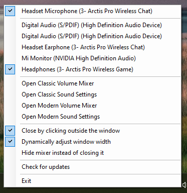

# What is Classic Volume Mixer
In Windows 11 the old volume mixer was "removed" and instead a new mixer was added to the settings app.

I really don't like this due to it's HUGE size in comparison. Luckily the old exe is still available in system32, so we just need a convenient way to open it. 

That's pretty much what this is, this repo contains an application that add a new icon in the system tray that can be used to launch the old mixer.
It also comes with a few optional quality-of-life improvements, you can turn them on and off if you right-click on the icon

# Installation
To install it open a powershell window and type the command

> winget install PopeenCom.ClassicVolumeMixer

Alternatively you can download it from the releases page  
https://github.com/popeen/Classic-Volume-Mixer/releases

# Troubleshooting
If you get smartscreen error (blue box popup) this is because the file has not been signed and is still to new. You can click on "more info" and then "run anyway" to run it, this is only needed once. Or you can cancel the installation and install an older version for now where it has had time to verify that it is safe.

-----

